# 🌌 Word Voyager

> **"A language is a doorway to a new way of thinking."**

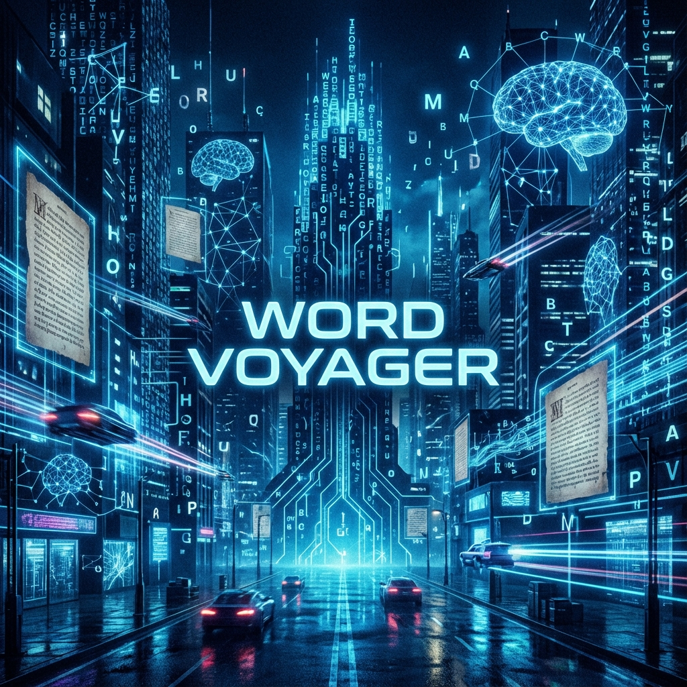

**Word Voyager** is an adaptive, progressive English vocabulary game specifically designed for Bengali speakers.

## 📖 The Philosophy

For those who think, dream, and create in Bangla, the voyage into English often requires a specialized map. Rote memorization is a fragile tool—it breaks under pressure. To truly master a language, one needs an intuitive, powerful, and adaptive tool that challenges the mind rather than just the memory.

**Word Voyager** was born from the conviction that learning should be:

* **Analytical**: Solving problems, not just recalling lists.
* **Challenging**: Pushing boundaries with every question.
* **Personalized**: Adapting to your unique pace and skill level.

---

## ⚙️ The Game Engine: Under the Hood

Word Voyager isn't just a quiz; it's a state-machine driven application that adapts to your cognitive performance in real-time.

### 1. The Adaptive Difficulty Algorithm

The game doesn't rely on static levels. It calculates your **Effective Level** dynamically based on your performance score.
> **Formula**: `CurrentLevel = BaseLevel + floor(Score / 100)`

This means every 100 points you earn pushes you into a harder tier of vocabulary, seamlessly transitioning from common words to rare, complex lexicon without interrupting gameplay.

### 2. The Binary Choice System

To balance *exploration* (new words) with *retention* (learning from mistakes), the game uses a weighted probability engine.

* **If you have no wrong answers**: The engine serves 100% new content.
* **If you have wrong answers**: The engine flips a coin (50/50 probability).
  * **Heads**: You face a **New Question** to keep moving forward.
  * **Tails**: You are forced to **Retry a Failed Question**. This ensures you cannot simply "skip" past your mistakes. You must master them.

### 3. The "Growth" Metric

Standard scoring only measures *what* you know. Word Voyager measures *how well* you know it using a custom **Growth Factor**.
> **Formula**: `Growth = (MaxTime - TimeTaken) * Accuracy`

* **Speed Matters**: Answering in 1 second is worth more "Growth" than answering in 10 seconds.
* **Accuracy is Key**: If you are wrong, Growth is 0, regardless of speed.
This metric is plotted on the final graph, showing you the exact trajectory of your cognitive processing speed over the session.

### 4. Hardcore Mode (The 5-Second Constraint)

In Hardcore Mode, the `MaxTime` variable is clamped to **5000ms**. This fundamentally changes the cognitive load, forcing you to rely on *system 1 thinking* (fast, intuitive) rather than *system 2* (slow, analytical), simulating high-pressure real-world fluency.

---

## 🎮 How to Play

---

## 🔬 The Data-Driven Methodology

The core strength of this game is its immense, hand-prepared dataset. The process was a time-intensive labor of logic and filtering.

### 1. The Raw Material

We started with a massive raw dataset of over **350,000** entries, synthesizing Bengali meanings in real-time to provide a contextual bridge.

### 2. The Filtering Process

We analyzed the data based on **Word Length** and **Complexity**.

#### The Word Data (Length Distribution)

This graph shows the makeup of the vocabulary based on character length.

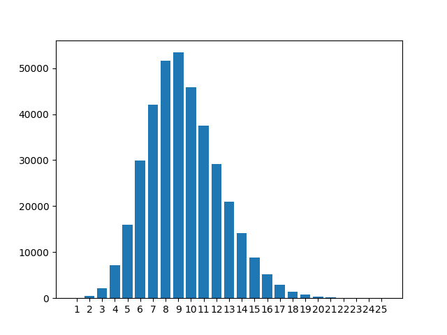

* **The Core Vocabulary (The Most Words)**: The tallest bars (8-10 chars) represent the "sweet spot" for intermediate English. Over 40% of the list falls here, ensuring endless variety in the middle levels (4-8).
* **The Easy Words**: Short words (1-6 chars) are for Introductory Levels (1-3) to build confidence.
* **The Hardest Words**: Rare, long words (15+ chars) are saved for the ultimate challenge in Levels 9-10.

#### The Pie Chart and Word Length Concentration

This chart visually confirms the data efficiency.

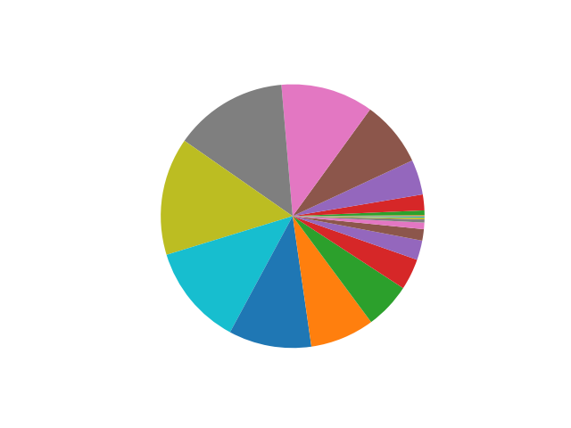

The largest data volume is intentionally concentrated in the 8-to-10 character range, optimizing the dataset for practical vocabulary rather than simple or extremely rare words.

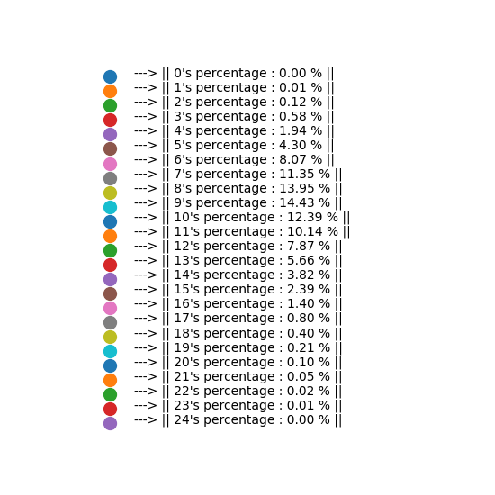
*(Percentages of the elements in the pie chart)*

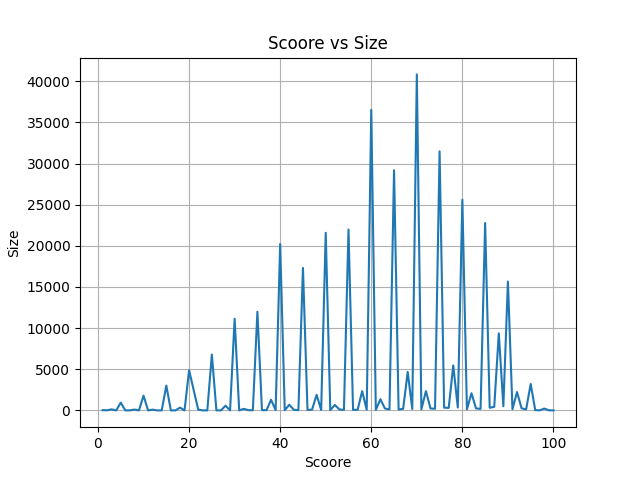

### 3. The "Hardness" Score

We assigned a "Hardness Score" to every single word.

#### Post-Processing Data Analysis (Score vs. Size)

The X-axis represents Hardness Level, and the Y-axis represents the number of words.


#### Analysis of the Graph

* **Categorized Difficulty**: Words are sorted into distinct groups, ensuring a true step-up in difficulty between levels.
* **Focus on Mastery**: The majority of challenging content is in the middle scores, supporting the intermediate levels.

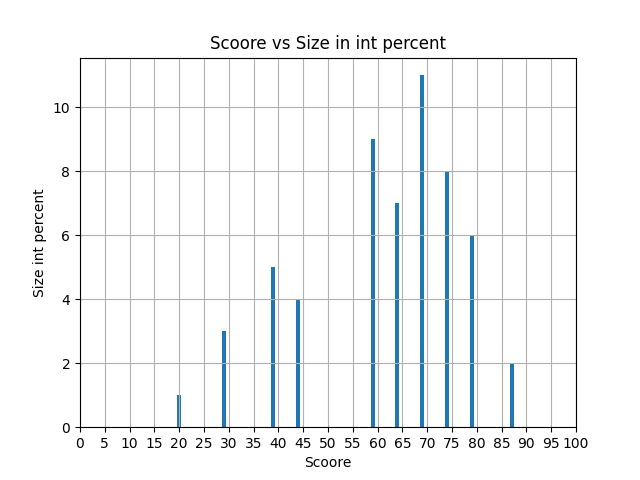

#### Normalization (Percentage Calculation)

We converted raw counts to percentages to make the distribution comparable. The 10 bars shown cover 86% of the data.

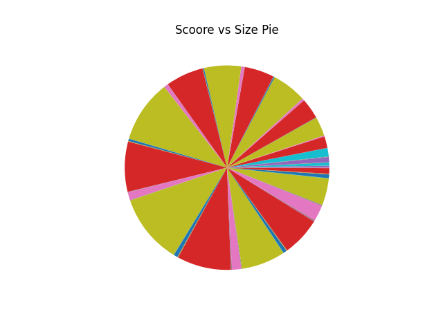

#### Observations

The data confirms that specific groups hold the most words, validating our level design.

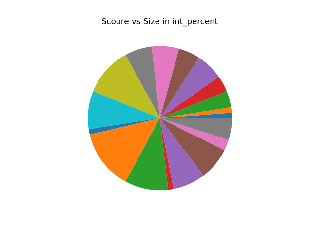
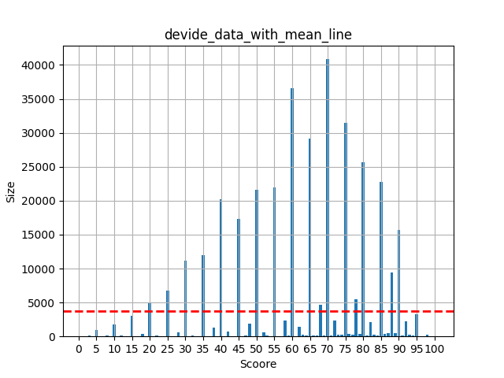

#### Score Distribution with Mean Line

The horizontal red dashed line represents the Average Expected Word Count if the data were divided equally.

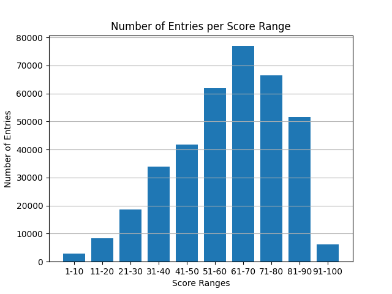

#### Grouped Score Distribution (The Bell Curve)

The data forms a clear, symmetrical bell curve.

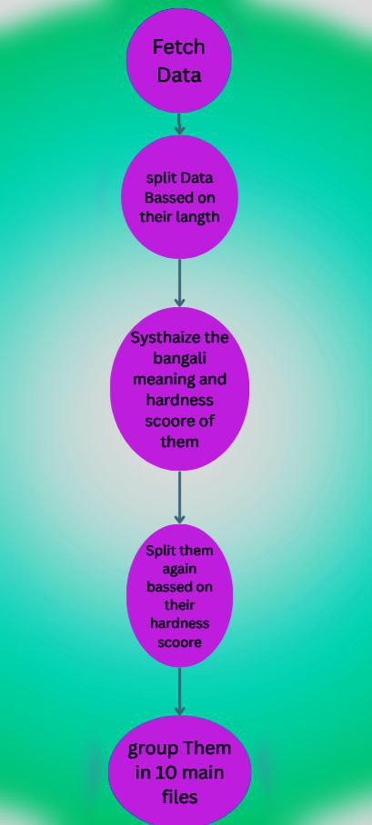

* **Validation**: The curve peaks in the 61-70 score range (~77,000 entries), confirming that the core levels are supported by the greatest volume of diverse content.

---

## 📸 Visual Guide

### 1. Setup Your Voyage

Customize your experience. Select your starting level, the number of questions, and toggle **Hardcore Mode** for the ultimate 5-second challenge.
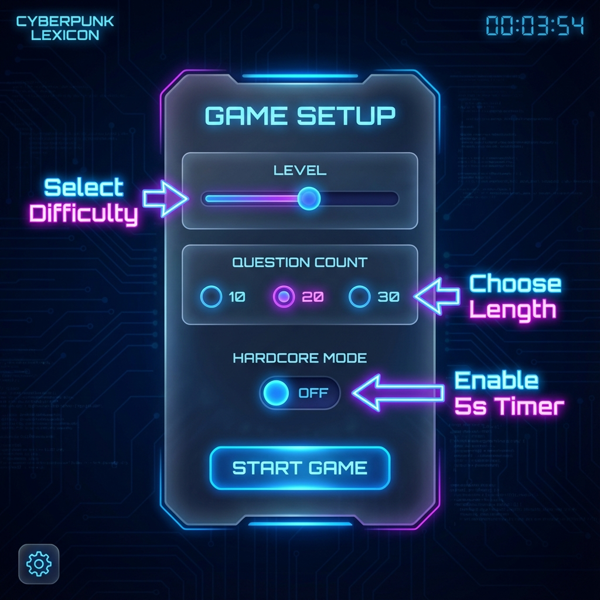

### 2. The Game Interface

Focus on the meaning. Watch the timer. Select the correct word before time runs out.
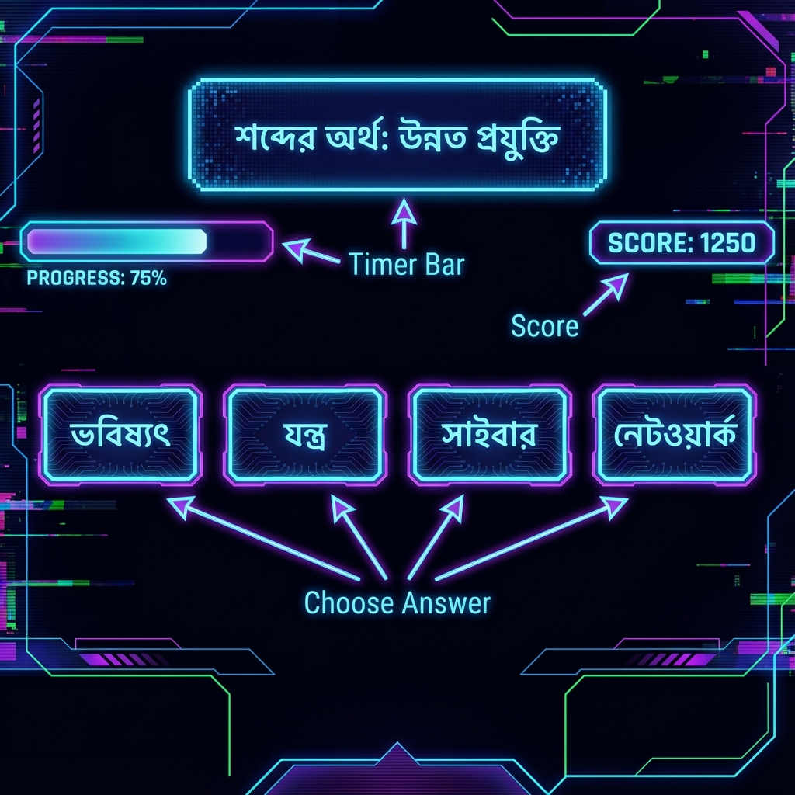

### 3. Track Your Growth

Analyze your performance. The graph shows both your score accumulation and your "Growth" (Speed + Accuracy) over time.
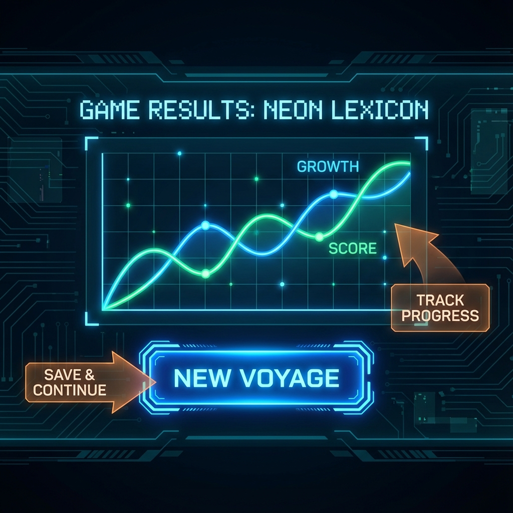

---

## 📂 Project Structure & File Guide

The project is organized for clean deployment and maintainability.

```text
Word-Voyager/
├── public/                  # The core deployable game folder
│   ├── index.html           # The main game interface (Setup, Game, Result screens)
│   ├── style.css            # Cyberpunk styling, glassmorphism, and responsive layout
│   ├── script.js            # Game logic, state management, and adaptive algorithms
│   ├── data/                # JSON files containing the question database
│   │   ├── level_1.json     # Beginner vocabulary
│   │   └── ...              # Levels 2-10
│   ├── sound/               # Audio assets
│   │   ├── 2.mp3            # Background ambience
│   │   ├── Right.mp3        # Success sound effect
│   │   └── Wrong.mp3        # Failure sound effect
│   ├── src_font/            # Custom typography
│   │   └── normal.ttf       # The game's primary font
│   └── src_imgs/            # Visual assets for documentation
└── README.md                # This documentation file
```

## ⚙️ Technical Workflow

### 1. Initialization

* **Loading**: `index.html` loads the CSS and JS. `script.js` initializes the `GameState` object, loading any saved `sessionHistory` from `localStorage`.
* **Setup**: The user interacts with the Setup Screen. Event listeners update the `GameState` configuration (Level, Question Count, Hardcore Mode).

### 2. The Game Loop

* **Question Fetching**: Based on the calculated `CurrentLevel`, the script fetches the corresponding `level_X.json` from the `data/` folder.
* **Binary Decision**: The engine decides whether to serve a **New Question** (from the JSON) or a **Retry Question** (from the `wrongAnswers` array).
* **Rendering**: The UI updates with the Bengali meaning and 4 English options. The Timer starts.

### 3. Interaction & Feedback

* **Input**: When a user clicks an option, the timer stops.
* **Validation**: The answer is checked. `GameState.score` and `GameState.cumulativeScore` are updated.
* **Persistence**: The result is pushed to `sessionHistory` and immediately saved to `localStorage`.
* **Feedback**: Visual (Green/Red glow) and Audio cues play immediately.

### 4. Visualization

* **Result Screen**: At the end of the round, `Chart.js` reads the full `sessionHistory`.
* **Graphing**: It plots two datasets: "Growth" (Speed/Accuracy) and "Cumulative Score", allowing the user to visualize their long-term progress.

## ✅ Verification & Performance

This project has undergone rigorous testing to ensure stability and performance.

* **Browser Compatibility**: Verified on Chrome and Firefox (Desktop & Mobile viewports).
* **Asset Loading**: Confirmed all sounds, fonts, and JSON data load correctly via relative paths.
* **Persistence Check**: Verified that reloading the page or starting a "New Voyage" correctly retains the user's lifetime score and graph history.
* **Performance**: The game runs at 60fps with smooth CSS transitions and instant audio feedback.

---

## 👨‍💻 About Developer

This entire game was designed and prepared from zero by **Tiyas Banerjee** (find the work on [Github](//github.com/Tiyasbanerjee)) during **October 2025**, while in **Class 9 at Biruha Sarat Chandra Uchha Vidyalaya**, with the guidance of **Koushik Sir** and **Ayan Ghoshal Sir**.

*This project is fully free and user-friendly—no ads, no financial benefit. We are deeply committed to open source and will continue to work on small updates to make the Word Voyager journey ever smarter and more effective.*

---
*Created with ❤️ and Logic in India.*
